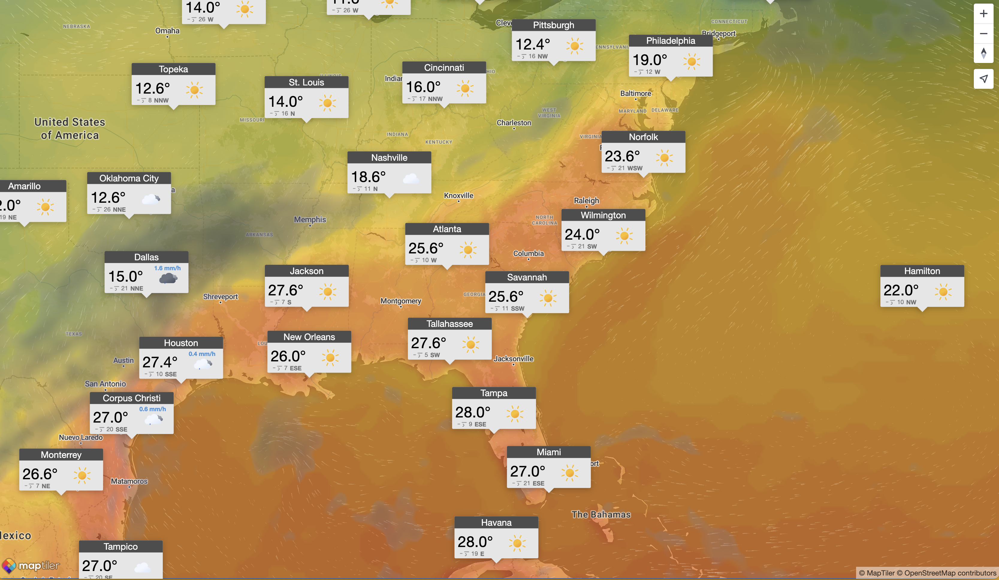

# Weather Popup App

This is to demonstrate the use of custom markers.

# Weather Icons
For this demo, we used [Meteocons](https://bas.dev/work/meteocons), an MIT licensed weather icon pack designed by [Bas Milius](https://github.com/basmilius) also available on [GitHub](https://github.com/basmilius/weather-icons).