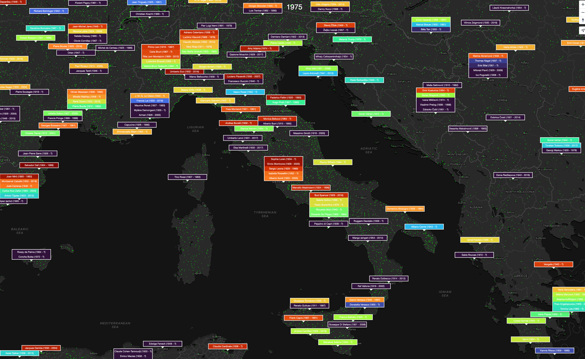
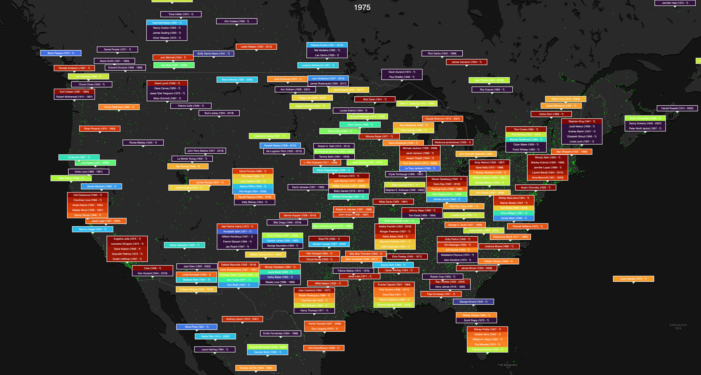

# MapTiler Popup Manager for MapTiler SDK
The Popup Manager is a helper to create non-coliding popup overlays on top of MapTiler SDK. Fed by a **vector layer** from a tileset or from a GeoJSON source, it can be tuned with plenty of options.
Thanks to its non opinionated and logic-only approach, it lets you bind any kind of rendering you wish for your popups: vanilla HTML Divs, React components, floating canvas, etc.

## Some Examples
Here is only a few examples of what's possible with fairly basic HTML popups.

With popups anchored to the city layers, directly fueled by the `Streets` style from MapTiler Cloud:


With popups fuled by a "famous personnalities" layer we have been working on, using the Turbo color ramp (from MapTiler SDK) to highlight the rankink:


Same as above, but centered on Italy and filtered for the year 1975:


Same as above, but centered on the USA and filtered for the year 1975:


Popup can be of any size, so we can display more info and feature links to Wikidata page:


Displaying weather data is also a nice usecase. For this, we bind popups to cities, towns and villages present in one of the official MapTiler Cloud style and then we asynchronously fetch the weather data using [MapTiler Weather library](https://www.maptiler.com/weather/), for each vector features using their coordinates:


Smaller popups with transparent background is a nice way to avoid cluter. Icons are SVG animated:


Since popups are overlaying on top of a map, it's generally a good practice to keep them small, so that the basemap remains readable, but Popup manager does not technically enforce that.

## Some Concepts
The Popup Manager...
- computes screen-space popups logic windows
- is fed with vector layer, using only the point features
- create non-overlapping bounding boxes
- can filter and sort features
- can group multiple features into each popup
- when updated will retrieve three lists of popups relative to the previous state: the new popups, the removed popups and the moved popups
- does not enforce how the the actual visual popups (eg. divs) should be created, cached, pooled, reused or deleted
- will not create a popup if another one of higher importance (based on default or provided ranking) is overlaping

## Usage
To install it:
```bash
npm install @maptiler/popup-manager
```
Then, import it:

```ts
import { PopupManager } from "@maptiler/popup-manager";

...

const popupManager = new PopupManager(map, options);
```


Or it can be used from MapTiler Cloud CDN with vanilla JS:

```html
<script src="https://cdn.maptiler.com/maptiler-popup-manager/v1.0.0/maptiler-popup-manager.umd.js"></script>
```
And then be address as such:
```js
const popupManager = new maptilerpopupmanager.PopupManager(map, options);
```

### Options
Here are all the options available:
```ts
{
  /**
   * IDs of layers to query for vector features.
   * Default: uses all the layers available
   */
  layers?: Array<string>;

  /**
   * Size of the popups on screen space [width, height].
   * Default: `[150, 50]`
   */
  popupSize?: [number, number];

  /**
   * Maximum number of popups to keep.
   * Default: no maximum
   */
  max?: number;

  /**
   * Position of the popup compared to its anchor point.
   * Default: `"center"`
   */
  popupAnchor?: PopupAnchor;

  /**
   * Offset to apply to the popup, in number of pixel, relative to its anchor position.
   * First element of the array is the horizontal offset where negative shifts towards
   * the left and positive shifts towards the right.
   * Second element of the array is the vertical offset where negative shifts towards
   * the top and positive shifts towards the bottom.
   * Default: `[0, 0]`
   */
  offset?: [number, number];

  /**
   * A filter function can be provided. Each feature will be tested against this filter function,
   * and the returned value can be `true` (the feature is kept) or `false` (the feature is discarded).
   * Default: none
   */
  filter?: (feature: MapGeoJSONFeature) => boolean;

  /**
   * Property to sort the features by. If not provided, the features will not be sorted.
   * Default: not provided
   */
  sortingProperty?: string,

  /**
   * Sorting order, only relevant if the option `.sortingProperty` is provided, or else will be ignored.
   * Default: `"ascending"`
   */
  sortingOrder?: "ascending" | "descending",

  /**
   * Property to group by. The property must be present in the `properties` object of the feature
   * unless the value of `groupBy` is equal to `"coordinates"`, then the geometry coordinates are
   * being used.
   * Default: no grouping
   */
  groupBy?: string,

  /**
   * Popups can contain multiple features, this parameter can be set to have a strict limit.
   * Default: `Infinity`
   */
  maxNbFeaturesPerPopup?: number,

  /**
   * When a popup contains multiple features, its size can get bigger. This number is the max ratio applied to the
   * defined `popupSize`. Intentionnaly non-integer so that the user can see there is still half an element to
   * show at the bottom and undestand they can scroll for more.
   * Default: `2.5`
   */
  maxRatioUnitSize?: number,
}
```

## API
Appart from the constructor, there are a few things to get familiar with.

### AbstractPopup
They are simple data structure that hold informations about the popup (position, size)
and the list of vector features it is supposed to contain. Here is how it looks like:

```ts
type AbstractPopup = {
  /**
   * Unique ID of a popup, most likely the ID of a geojson feature (from a vector tile)
   */
  id: number;

  /**
   * Position in screenspace of the top-left corner [x, y]
   */
  position: [number, number];

  /**
   * Size in screen space [width, height]
   */
  size: [number, number];

  /**
   * The feature represented by the popup
   */
  features: MapGeoJSONFeature[];

  /**
   * Size of each internal elements (useful for when a popup contain information about multiple feature)
   */
  internalElementSize: [number, number],
};
```
Again, an *abstract popup* is **not** an actual visual popup. It only aims at providing the information to help making an actual popup.

### PopupMap
The type `PopupMap` is simply a [JS Map](https://developer.mozilla.org/en-US/docs/Web/JavaScript/Reference/Global_Objects/Map) of `AbstractPopup`

```ts
type PopupMap = Map<number, AbstractPopup>;
```

### PopupStatus
An object of type *PopupStatus* is a simple data structure that contain li

```ts
/**
 * Status of the popup compared to the previous status
 */
type PopupStatus = {
  /**
   * The popups that were added since the last update
   */
  new: PopupMap;

  /**
   * The popups that were already present in the last update but had their position changed
   */
  updated: PopupMap;

  /**
   * The popups that are no longer present since the last update
   */
  removed: PopupMap;
};
```

### Updating
As we interact with the map (pan, zoom, rotation, etc.) we need to know weither new popups are now visible, or just moved outside of the viewport and the updated positions of the ones that, since the last update, are visible.

For this, a `PopupManager` instance has two methods: `.update()` and `.softUpdateAbstractPopup()`

- `.update()` can be called everytime we need to update the position and content of all the abstract popups. This method return


## Examples
Here is an example:
```js
const popupManager = new PopupManager(map, {
  // Select features from those two layers
  layers: ["culture_layer", "science_layer"],

  // Popup size are planned to be 160x20, so collision will be computed accordingly
  popupSize: [160, 20],

  // The popups will be placed on top of each point feature
  popupAnchor: "top",

  // This offset will be applied to the anchor because we want
  // to display a small pointy tip at the bottom of the popup
  offset: [0, -10],

  // We want to group the popups by coordinates
  groupBy: "coordinates",

  // The size of a popup can be at most 5 times the height of a unit popup
  // (5 x 20 as defined above in the option popupSize). This size will be
  // reached only by popups that contain a group of 5 or more elements
  maxRatioUnitSize: 5,

  // We want to sort by the property `rank`
  sortingProperty: "rank",

  // The sorting is in ascending order (lowest rank values get the priority)
  sortingOrder: "ascending",

  // When grouping, we may want popup to not reference more than a certain number of
  // features. This is a cutoff value.
  // Not to be confused with `.maxRatioUnitSize`, which is only about the graphic size,
  // but could have an internal scrolling to display up to `maxNbFeaturesPerPopup` elements.
  maxNbFeaturesPerPopup: 6,

  // We want to apply a dynamic filtering (called with every `.update()`) where we discard
  // features that have a `rank` property greater than 20000.
  // This can be used for all sort of filetering, eg. features inside a dynamic bounding box
  filter: (feature) => {
    return feature.properties.rank < 20000
  },
});
```
