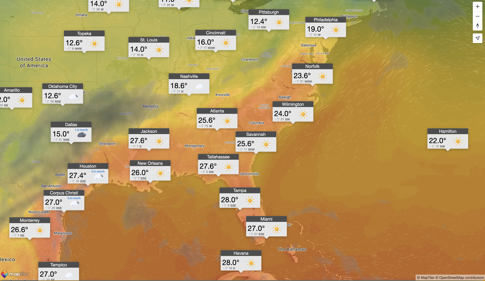

# MapTiler Marker layout for MapTiler SDK

The Marker Layout is a helper to create non-coliding marker overlays on top of [MapTiler SDK](https://docs.maptiler.com/sdk-js/). Fed by a **vector layer** from a tileset or from a GeoJSON source, it can be tuned with plenty of options.
Thanks to its non opinionated and logic-only approach, it lets you bind any kind of rendering you wish for your markers: vanilla HTML Divs, React components, floating canvas, etc. as it computes the position and size of the markers but lets you take handle the rendering part.

[](https://www.npmjs.com/package/@maptiler/marker-layout) 

---

📖 [Documentation](https://docs.maptiler.com/sdk-js/modules/marker-layout/) &nbsp; 📦 [NPM Package](https://www.npmjs.com/package/@maptiler/marker-layout) &nbsp; 🌐 [Website](https://docs.maptiler.com/sdk-js/modules/marker-layout/) &nbsp; 🔑 [Get API Key](https://cloud.maptiler.com/account/keys/)

---

<br>

<details> <summary><b>Table of Contents</b></summary>
<ul>
<li><a href="#-installation">Installation</a></li>
<li><a href="#-basic-usage">Basic Usage</a></li>
<li><a href="#-related-examples">Examples</a></li>
<li><a href="#-api-reference">API Reference</a></li>
<li><a href="#-support">Support</a></li>
<li><a href="#-contributing">Contributing</a></li>
<li><a href="#-license">License</a></li>
<li><a href="#-acknowledgements">Acknowledgements</a></li>
</ul>
</details>

<p align="center">     <br />  <a href="https://docs.maptiler.com/sdk-js/examples/marker-layout-weather/">See live interactive demo</a> </p>
<br>

## 📦 Installation

### ES module from NPM

```shell
npm install @maptiler/sdk @maptiler/marker-layout
```

Then, import it:

```ts
import { MarkerLayout } from "@maptiler/marker-layout";
```

### Vanilla JS from CDN (UMD bundles)

```html
<script src="https://cdn.maptiler.com/maptiler-marker-layout/latest/maptiler-marker-layout.umd.js"></script>
```
And then be address as such:

```js
const markerLayout = new maptilermarkerlayout.MarkerLayout(map, options);
```

<br>

## 🚀 Basic Usage

```js
import { Map, MapStyle, config } from '@maptiler/sdk';
import '@maptiler/sdk/dist/maptiler-sdk.css';
import { MarkerLayout } from '@maptiler/marker-layout';

const appContainer = document.getElementById('map');

  config.apiKey = 'YOUR_MAPTILER_API_KEY_HERE';

  // Creating a map
  const map = new Map({
    container: appContainer,
    style: MapStyle.STREETS,
    geolocate: true
  });

  // Creating the div that will contain all the markers
  const markerContainer = document.createElement("div");
  appContainer.appendChild(markerContainer);

  (async () => {
    await map.onReadyAsync();

    const markerManager = new MarkerLayout(map, {
      layers: ["Capital city labels", "City labels", "Place labels", "Town labels"],
      markerSize: [140, 80],
      markerAnchor: "top",
      offset: [0, -8], // so that the tip of the marker bottom pin lands on the city dot
      sortingProperty: "rank",

      // With `sortingProperty` option as a function, the following is equivalent to the above
      // sortingProperty: (feature) => {
      //   return feature.properties.rank;
      // },

      filter: ((feature) => {
        return ["city", "village", "town"].includes(feature.properties.class)
      })
    });


    // This object contains the marker DIV so that they can be updated rather than fully recreated every time
    const markerLogicContainer = {};

    // This function will be used as the callback for some map events
    const updateMarkers = () => {
      const markerStatus = markerManager.update();

      if (!markerStatus) return;

      // Remove the div that corresponds to removed markers
      markerStatus.removed.forEach((abstractMarker) => {
        const markerDiv = markerLogicContainer[abstractMarker.id];
        delete markerLogicContainer[abstractMarker.id];
        markerContainer.removeChild(markerDiv);
      });

      // Update the div that corresponds to updated markers
      markerStatus.updated.forEach((abstractMarker) => {
        const markerDiv = markerLogicContainer[abstractMarker.id];
        updateMarkerDiv(abstractMarker, markerDiv);
      });

      // Create the div that corresponds to the new markers
      markerStatus.new.forEach((abstractMarker) => {
        const markerDiv = makeMarker(abstractMarker);
        markerLogicContainer[abstractMarker.id] = markerDiv;
        markerContainer.appendChild(markerDiv);
      });
    }

    // The "idle" event is triggered every second because of the particle layer being refreshed,
    // even though their is no new data loaded, so this approach proved to be the best for this scenario
    map.on("move", updateMarkers);

    map.on("moveend", () => {
      map.once("idle", updateMarkers);
    })

    updateMarkers();
  })()


function makeMarker(abstractMarker) {

  const marker = document.createElement("div");
  marker.classList.add("marker");
  marker.classList.add('fade-in-animation');
  marker.style.setProperty("width", `${abstractMarker.size[0]}px`);
  marker.style.setProperty("height", `${abstractMarker.size[1]}px`);
  marker.style.setProperty("transform", `translate(${abstractMarker.position[0]}px, ${abstractMarker.position[1]}px)`);

  const feature = abstractMarker.features[0];

  marker.innerHTML = `
    <div class="markerPointy"></div>
    <div class="markerBody">

      <div class="markerTop">
        ${feature.properties["name:en"] || feature.properties["name"]}
      </div>

      <div class="markerBottom">
        <ul>
          <li><b>Name:</b> ${feature.properties.name}</li>
          <li><b>Class:</b> ${feature.properties.class}</li>
          <li><b>Rank:</b> ${feature.properties.rank}</li>
        </ul>
      </div>
    </div>
  `
  return marker;
}

function updateMarkerDiv(abstractMarker, marker) {
  marker.style.setProperty("width", `${abstractMarker.size[0]}px`);
  marker.style.setProperty("height", `${abstractMarker.size[1]}px`);
  marker.style.setProperty("transform", `translate(${abstractMarker.position[0]}px, ${abstractMarker.position[1]}px)`);
}
```

<br>

## 💡 Related Examples

- [Create custom marker overlays using the Marker Layout](https://docs.maptiler.com/sdk-js/examples/marker-layout-many/)
- [Weather map with custom icons, animated SVGs or Lotties via Marker Layout](https://docs.maptiler.com/sdk-js/examples/marker-layout-weather/)
- [3D globe with custom marker overlays](https://docs.maptiler.com/sdk-js/examples/globe-marker-layout/)

Check out the full list of [MapTiler examples](https://docs.maptiler.com/sdk-js/examples/?q=marker+layout)

<br>

## 📘 API Reference

For detailed guides, API reference, and advanced examples, visit our comprehensive documentation:

[API documentation](https://docs.maptiler.com/sdk-js/modules/marker-layout/api/api-reference/)

### Options

Here are all the options available:
```ts
{
  /**
   * IDs of layers to query for vector features.
   * Default: uses all the layers available
   */
  layers?: Array<string>;

  /**
   * Size of the markers on screen space [width, height].
   * Default: `[150, 50]`
   */
  markerSize?: [number, number];

  /**
   * Maximum number of markers to keep.
   * Default: no maximum
   */
  max?: number;

  /**
   * Position of the marker relative to its anchor point.
   * Default: `"center"`
   */
  markerAnchor?: MarkerAnchor;

  /**
   * Offset to apply to the marker, in number of pixel, relative to its anchor position.
   * First element of the array is the horizontal offset where negative shifts towards
   * the left and positive shifts towards the right.
   * Second element of the array is the vertical offset where negative shifts towards
   * the top and positive shifts towards the bottom.
   * Default: `[0, 0]`
   */
  offset?: [number, number];

  /**
   * A filter function can be provided. Each feature will be tested against this filter function,
   * and the returned value can be `true` (the feature is kept) or `false` (the feature is discarded).
   * Default: none
   */
  filter?: (feature: MapGeoJSONFeature) => boolean;

  /**
   * Property to sort the features by. If not provided, the features will not be sorted.
   * Default: not provided
   */
  sortingProperty?: string,

  /**
   * Property to sort the features by. If not provided, the features will not be sorted.
   * Alternatively, the sorting property can be a function that takes the feature as
   * argument and returns a number, aka. the sorting value (or rank)
   * Default: not provided
   */
  sortingProperty?: string | ((feature: MapGeoJSONFeature) => number);

  /**
   * Property to group by. The property must be present in the `properties` object of the feature
   * unless the value of `groupBy` is equal to `"coordinates"`, then the geometry coordinates are
   * being used.
   * Default: no grouping
   */
  groupBy?: string,

  /**
   * Markers can contain multiple vector features, this parameter can be set to have a strict limit.
   * Default: `Infinity`
   */
  maxNbFeaturesPerMarker?: number,

  /**
   * When a marker contains multiple features, its size can get bigger. This number is the max ratio applied to the
   * defined `markerSize`. Intentionnaly non-integer so that the user can see there is still half an element to
   * show at the bottom and undestand they can scroll for more.
   * Default: `2.5`
   */
  maxRatioUnitSize?: number,
}

// The possible anchor points
type MarkerAnchor = "center" | "top" | "bottom" | "left" | "right";
```

### AbstractMarker

They are simple data structure that hold informations about a marker (position, size)
and the list of vector features it is supposed to contain. Here is how it looks like:

```ts
type AbstractMarker = {
  /**
   * Unique ID of a marker, most likely the ID of a geojson feature (from a vector tile)
   */
  id: number;

  /**
   * Position in screenspace of the top-left corner [x, y]
   */
  position: [number, number];

  /**
   * Size in screen space [width, height]
   */
  size: [number, number];

  /**
   * The feature represented by the marker
   */
  features: MapGeoJSONFeature[];

  /**
   * Size of each internal elements (useful for when a marker contain multiple vector features)
   */
  internalElementSize: [number, number],
};
```
Again, an *abstract marker* is **not** an actual visual marker. It only aims at providing the information to help making an actual graphic representation of a marker.

### MarkerMap

The type `MarkerMap` is simply a [JS Map](https://developer.mozilla.org/en-US/docs/Web/JavaScript/Reference/Global_Objects/Map) of `AbstractMarker`. The *key* of this map (*number*) is a hash specific to one of multiple vector features contained by a marker. If you want to add an extra caching logic, you may want to track this ID, otherwise it's only used internaly and is of little interest at application level.

```ts
type MarkerMap = Map<number, AbstractMarker>;
```

### MarkerStatus

An object of type *markerStatus* is a simple data structure that contain li

```ts
/**
 * Status of the marker compared to the previous status
 */
type MarkerStatus = {
  /**
   * The markers that were added since the last update()
   */
  new: MarkerMap;

  /**
   * The markers that were already present in the last update but had their position changed
   */
  updated: MarkerMap;

  /**
   * The markers that are no longer present since the last update
   */
  removed: MarkerMap;
};
```

### Methods

As we interact with the map (pan, zoom, rotation, etc.) we need to know which markers are now visible, disapeared outside the viewport or are still visible but at a different (screen space) location.

To compute this, a `MarkerLayout` instance has two methods:
- `.update()` compute a complete new status of markers, returning a `MarkerStatus`.  
In case many vector features are found in the specified `layers` with the provided `filter`, this may have an impact on performances and may not be suitable to call from a `map.on("move", () => { ... })` event.

- `.softUpdateAbstractMarker(am)` only update a single `AbstractMarker` with a new screenspace position.  
This is convenient to use when there are hundreds of vector features found but we only want to update the position, say, of the ones retrieved with the previous full `.update()` call. In this performance-wise conservative mode, one would typically bind `.update()` to the `Map` event `"idle"` and bind `.softUpdateAbstractMarker(am)` to the `Map` event `"move"`.

We can also reset the internal `MarkerStatus` if we need to restart from a blank slate without creating a new `MarkerLayout` instance:

- `.reset()` 

<br>

## 💬 Support

- 📚 [Documentation](https://docs.maptiler.com/sdk-js/modules/marker-layout/) - Comprehensive guides and API reference
- ✉️ [Contact us](https://maptiler.com/contact) - Get in touch or submit a request
- 🐦 [Twitter/X](https://twitter.com/maptiler) - Follow us for updates

<br>

---

<br>

## 🤝 Contributing

We love contributions from the community! Whether it's bug reports, feature requests, or pull requests, all contributions are welcome:

- Fork the repository and create your branch from `main`
- If you've added code, add tests that cover your changes
- Ensure your code follows our style guidelines
- Give your pull request a clear, descriptive summary
- Open a Pull Request with a comprehensive description

<br>

## 📄 License

This project is licensed under the MapTiler JS Module License – see the [LICENSE](./license.md) file for details.

<br>

## 🙏 Acknowledgements

This project is built on the shoulders of giants:

- [MapTiler SDK JS](https://www.maptiler.com/interactive-maps/) – The open-source mapping library

Here is only a few examples of what's possible with fairly basic HTML markers.

With markers anchored to the city layers, directly fueled by the `streets-v2` style from MapTiler Cloud:


Displaying weather data is also a nice usecase. For this, we anchor the markers to cities, towns and villages from an official MapTiler Cloud style and then we asynchronously fetch the weather data using [MapTiler Weather library](https://www.maptiler.com/weather/), for each vector features using their coordinates:



**But markers don't need to look like markers!** Smaller markers with transparent background are a nice way to avoid cluter. Icons are SVG animated:


Since markers are overlaying on top of a map, it's generally a good practice to keep them small, so that the basemap remains readable, but **Marker Layout** does not technically enforce that.

### Some Concepts
The Marker Layout...
- computes screen-space bounding box logic
- can be provided the desired marker size and relative anchor point
- is fed with one or multiple vector layer
- can only use *point* features
- create non-overlapping bounding boxes
- can filter and sort features based on vector feature properties
- sorting can be done with a function, so that rank can come from an external source
- can group multiple vector features into each marker
- when updated will retrieve three lists of markers relative to the previous state: the new, the removed and the moved markers
- does not enforce how the the actual visual markers (eg. divs) should be created, cached, pooled, reused or deleted

<br>

<p align="center" style="margin-top:20px;margin-bottom:20px;"> <a href="https://cloud.maptiler.com/account/keys/" style="display:inline-block;padding:12px 32px;background:#F2F6FF;color:#000;font-weight:bold;border-radius:6px;text-decoration:none;"> Get Your API Key <sup style="background-color:#0000ff;color:#fff;padding:2px 6px;font-size:12px;border-radius:3px;">FREE</sup><br /> <span style="font-size:90%;font-weight:400;">Start building with 100,000 free map loads per month ・ No credit card required.</span> </a> </p>

<br>

<p align="center"> 💜 Made with love by the <a href="https://www.maptiler.com/">MapTiler</a> team <br />
<p align="center">
  <a href="https://docs.maptiler.com/sdk-js/modules/marker-layout/">Website</a> •
  <a href="https://docs.maptiler.com/sdk-js/modules/marker-layout/">Documentation</a> •
  <a href="https://github.com/maptiler/maptiler-marker-layout/">GitHub</a>
</p>